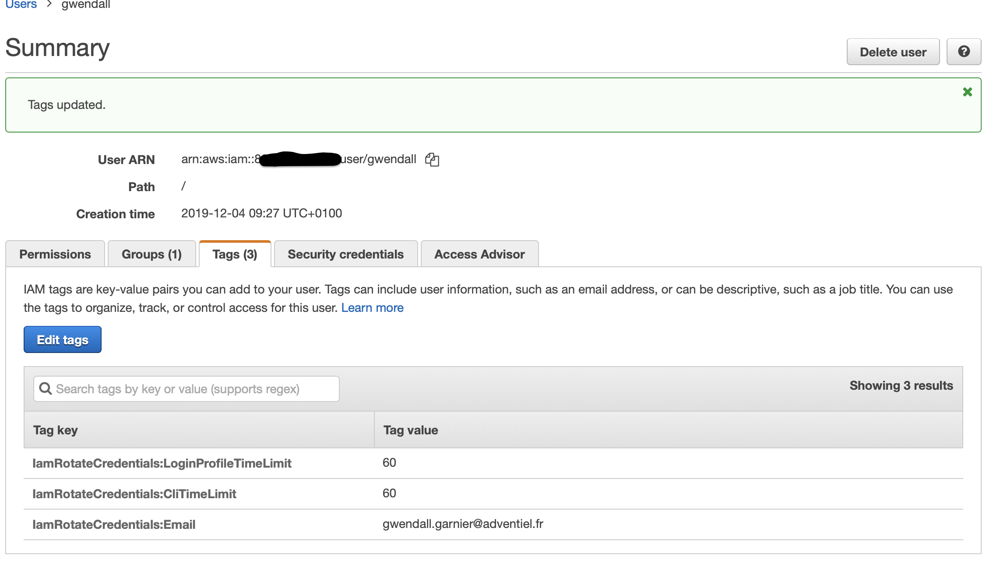
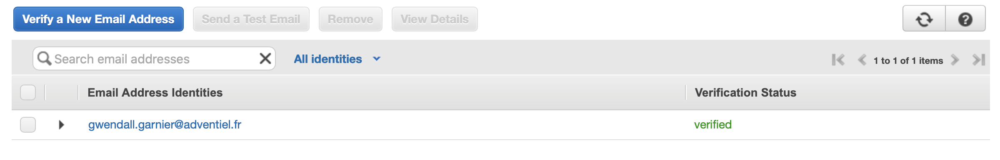

<table>
  <tr>
    <td style="text-align: center; vertical-align: middle;"></td>
    <td style="text-align: center; vertical-align: middle;"></td>
  </tr> 
<table>

# AWS IAM rotate credential

This terraform module aims to create a lambda function that refreshes the IAM credentials (login profile / access keys) as they become obsolete

## I - Prerequisites

In order to activate the rotation feature it is necessary to do the following actions before the terraform deployment

### I.1 - Add tag on user

To identify an AWS user as a user with ID rotation, it is necessary to add a tag to this user. This tag must be **IamRotateCredentialEmail**. It must contain the email that will receive the new credentials.



### I.2 - Register Email/Domain on AWS SES

Once the tag is affixed to the user, the email or email domain must be registered in the AWS SES sevice. Otherwise no mails will be sent from AWS.



## I - Infrastructure components

This module create:

- 1 lambda function : **iam-rotate-credentials**

- 1 iam role for the lambda function : **iam-rotate-credentials-role**

- 1 iam policy for the iam role  : **iam-rotate-credentials-policy**

- 1 cloudwatch log group for the logs : **/aws/lambda/iam-rotate-credentials**

- 1 sns topic for result of lambda function execution : **iam-rotate-credentials-result**

## II - Inputs / Outputs

## Inputs

| Name | Description | Type | Default |
|------|-------------|:----:|:-----:|
| aws\_cli\_time\_limit | Maximum duration for an access with AWS CLI (expressed in days). | number | 60 |
| aws\_login\_profile\_password\_reset\_required | Requires that the console password be changed by the user at the next login. | bool | true |
| aws\_login\_profile\_time\_limit | Maximum duration for an access with login profile (expressed in days). | number | 60 |
| aws\_region | aws region to deploy (only aws region with AWS SES service deployed) | string | n/a |
| aws\_ses\_email\_from | email used to send emails to users when their credentials change. | string | n/a |
| cloudwatch\_log\_retention | The cloudwatch log retention ( default 7 days ). | number | 7 |
| function\_timeout | The amount of time your Lambda Functions has to run in seconds. | number | 300 |
| scan\_alarm\_clock | The time between two scan to search for expired certificates ( in minutes default 1440 = 1 days) | number | 1440 |

## III - Usage

````shell
module "iam_rotate_credentials"
{
  source = "git::https://github.com/AdventielFr/terraform-aws-iam-rotate-credentials.git?ref=1.0.0"
  
  aws_region                                = "eu-west-1"
  cloudwatch_log_retention                  = 10
  aws_cli_time_limit                        = 20
  aws_login_profile_time_limit              = 15
  aws_login_profile_password_reset_required = true
  aws_ses_email_from                        = "john.doe@nobody.com
}
`````